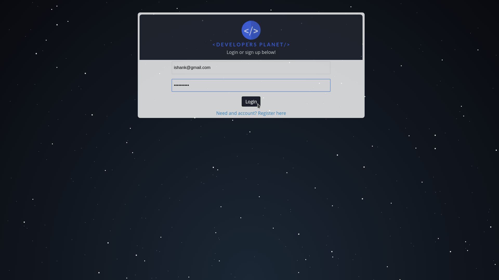

## TheDevelopersPlanet
###### Web Portal to interact and connect with all the cool developers around the world.

## Contribution
Feel free to contribute or create issues.

## Prerequisites
You need to have xampp installed on your system in order to run this application

## Running the application
+ Copy the files inside htdocs folder (htdocs can be found inside the XAMPP installation directory )
+ Run XAMPP and start apache and MySql server
+ Go to https://localhost and see the application

###### Additional Details
+ Don't forget to import the database file into phpmyadmin

## Features of the portal
+ Post status updates/photos
+ Follow Developers to keep yourself updated with what they post.
+ Make Friends, like/comment on status updates just like facebook
+ Directly message developers for any help and queries
+ Get notified when someone comments/likes your post
+ Create cool looking avatars for your profile picture

## Screenshots

